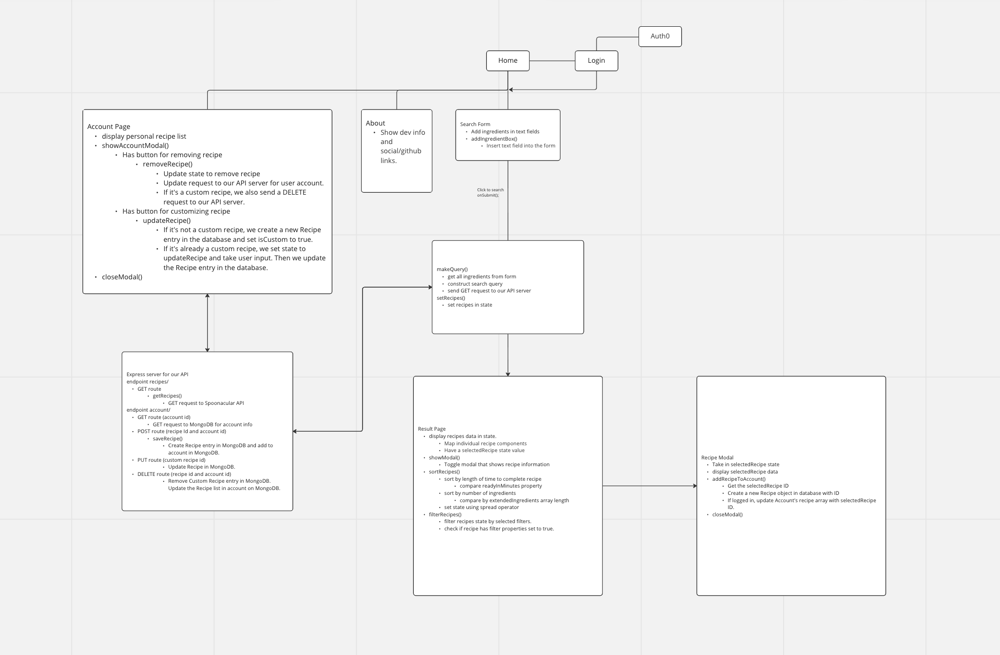
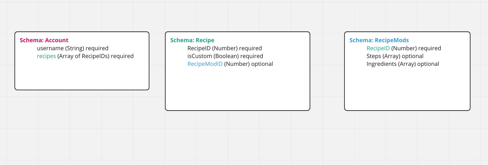

# GrubGuide Server

## Description
An API server for the GrubGuide client. This server makes use of the Spoonacular API for fetching recipe data and interfaces with MongoDB to store user accounts and saved recipes.

## Whiteboards

## Schema info

Account
* This is to keep track of user accounts that have logged in through Auth0.
* It holds the list of recipes for each user.

Recipe
* This holds the ID of the recipe that exists on Spoonacular API.
* This also keeps track if the recipe is customizable or not.
* Has a relationship to the list of recipes in Account.
* Has a relationship to the RecipeMods collection, which has modifications for custom recipes.

RecipeMod
* This holds the custom modifications for a recipe that a user has made.

## Installation

* Download or clone this repository.
* Use npm install to install dependencies.
* Create an account for the [Spoonacular API.](https://spoonacular.com/)
* Set up your .env file based on the .env.sample file.
* Use npm start or nodemon to run the server.

## Collaborators
***
Joel Myrtil, Daniel Yoon, Ahmed Mohamed, Phillip Chaplin